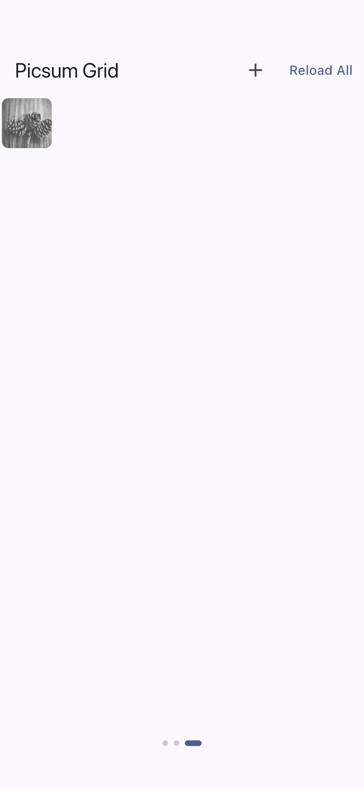

# elinext_grid

Flutter test task — a single-page app with a paginated grid of images backed by
[picsum.photos](https://picsum.photos), built with clean architecture, BLoC, and
`go_router`.

## Showcase

| Initial grid (page 1 of 2) | After tap **+** (auto-animated to the new last page) | After **Reload All** (auto-animated back to page 1) |
| --- | --- | --- |
|  |  |  |

Captured on iPhone 17e simulator via `flutter drive` (see `Make showcase`).

## Features

- 7×10 GridView with 2pt spacing, rounded corners (radius 7), horizontal
  pagination via `PageView`.
- Top bar: **+** appends one image; **Reload All** discards the current set
  and loads 140 fresh ones.
- **Auto-animate** to the new last page when the added image lands on a
  brand-new page; auto-animate back to page 1 on reload.
- Compact **page indicator** at the bottom that animates with the controller.
- Per-cell `CircularProgressIndicator` placeholder while
  `cached_network_image` fetches; broken-image fallback on failure.
- Localised strings (`en`, `vi`) via the standard `flutter gen-l10n`
  pipeline.

## Architecture

Clean architecture in a single Flutter package:

```
lib/
├── core/
│   ├── constants/grid_layout.dart      # 7 cols × 10 rows, 2pt spacing, r=7
│   └── di/                              # get_it + injectable wiring
├── data/
│   ├── datasources/                     # PicsumImageDataSource (URL + uuid)
│   └── repositories/                    # ImageRepositoryImpl
├── domain/
│   ├── entities/image_item.dart
│   ├── repositories/image_repository.dart
│   └── usecases/{add_image,load_image_batch}.dart
├── presentation/
│   ├── route/                           # IFeatureRoute, AppRouter (go_router)
│   └── modules/grid/
│       ├── grid_route.dart              # registers /
│       ├── grid_coordinator.dart        # extension on BuildContext
│       ├── bloc/                        # GridBloc + freezed events / state
│       └── views/{pages,widgets}/
└── l10n/                                # app_en.arb, app_vi.arb, generated
```

State management is `flutter_bloc` with `bloc_concurrency` transformers
(`droppable` for load/reload, `sequential` for add).

## Getting started

```bash
make setup        # pub_get + build_runner + gen-l10n
make run_chrome   # or run_ios / run_android
```

Top-level `Makefile` (`make help` lists everything):

| Target | What it does |
| --- | --- |
| `setup` | `pub_get` + `gen` (build_runner) + `lang` (gen-l10n) |
| `gen` | Run `build_runner` once (freezed + injectable) |
| `lang` | Regenerate `AppLocalizations` from `lib/l10n/*.arb` |
| `analyze` / `format` | Static analysis / `dart format` |
| `test` | Unit + widget tests |
| `coverage` | `flutter test --coverage` + open lcov HTML |
| `integration` | `flutter test integration_test -d chrome` |
| `run_chrome` / `run_ios` / `run_android` | Launch on a device |
| `build_web` / `build_apk` | Release builds |

## Tests

Each test group is named after the requirement bullet it covers
(see `requirement.txt`):

- **Unit** — `grid_bloc_test`, `picsum_image_data_source_test`.
- **Widget** — `image_cell_test` (corner radius 7, activity indicator),
  `paginated_grid_test` (7 cols × 10 rows, 2pt spacing, horizontal),
  `page_indicator_test`, `grid_page_test` (top bar buttons, empty state,
  PageIndicator visibility).
- **End-to-end** — `integration_test/app_test.dart` drives the full flow:
  initial 70 cells on page 0 → tap `+` → assert the controller animated to
  the new last page → tap `Reload All` → assert the controller animated
  back to page 0.

The showcase test (`integration_test/showcase_test.dart`) captures the
README screenshots through `flutter drive --driver=test_driver/integration_test.dart`:

```bash
flutter drive \
  --driver=test_driver/integration_test.dart \
  --target=integration_test/showcase_test.dart \
  -d "iPhone 17e"
```

## Tech

Flutter 3.38, Dart 3.10. Key deps:
`flutter_bloc`, `bloc_concurrency`, `freezed`, `cached_network_image`,
`go_router`, `get_it` + `injectable`, `intl`, `uuid`. Dev: `bloc_test`,
`integration_test`, `build_runner`.
